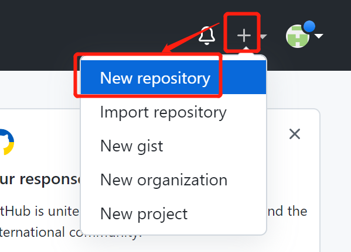
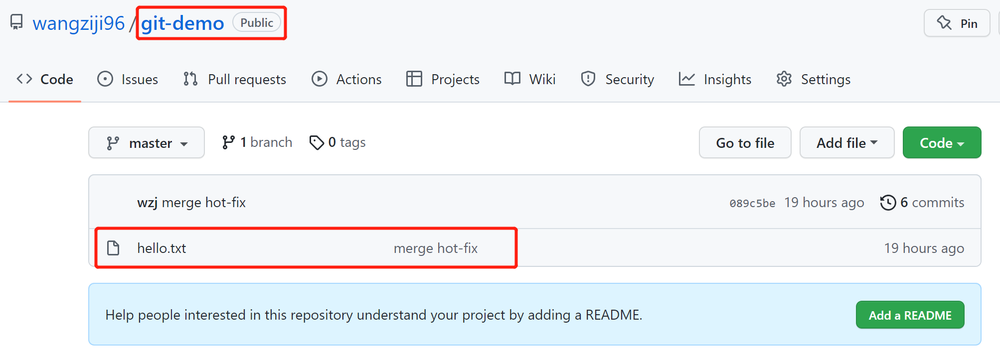

# 1.Git常用命令

| 命令名称                             | 作用               |
| ------------------------------------ | ------------------ |
| git config --global user.name 用户名 | 设置用户签名       |
| git config --global user.email 邮箱  | 设置用户签名       |
| **git init**                         | **初始化本地库**   |
| **git status**                       | **查看本地库状态** |
| **git add 文件名**                   | **添加到暂存区**   |
| **git commit -m "日志信息" 文件名**  | **提交到本地库**   |
| **git reflog**                       | **查看历史记录**   |
| **git reset --hard 版本号**          | **版本穿梭**       |

## 1.1设置用户签名

```shell
git config --global user.name wzj
git config --global user.email wzj@git.com
```

说明：签名的作用是区分不同操作者的身份，git不会去验证，**邮箱是我乱写的**。**Git首次安装必须设置一下用户签名，不然无法提交代码**。这里设置的用户名和邮箱与将来的代码托管平台，如：GitHub没有任何关系。

## 1.2初始化本地库

1.基本语法

git init

2.实操

1.在D盘新建一个目录Git-Space；2.在这个目录里面创建一个目录git-demo；3.在git-demo目录里面，右键，选择Git Bash Here，就能在当前目录使用git；4.运行 git init

3.结果


## 1.3查看本地库状态

git status

### 1.3.1首次查看（工作区没有任何文件）


### 1.3.2新增文件（hello.txt）


### 1.3.3再次查看（检测到未追踪文件）

本地库还是空的，但是它能发现有文件出现了，只是还没添加进去本地库


### 1.3.4添加暂存区

基本语法

```shell
git add 文件名
```

案例实操


再次查看状态


先将文件添加回来先，毕竟后续实验还需要它


### 1.3.5提交本地库

将暂存区的文件提交到本地库

```shell
git commit -m "日志信息" 文件名
```


查看状态


### 1.3.6修改文件


查看状态（**检测到工作区有文件被修改**）


将修改文件再次添加到暂存区


提交到版本库


**小结：**git status能够发现工作区的变化，比如新增了文件。当你将文件**添加到暂存区的时候**，git-status也能发现，并给出对应提示。当将暂存区的文件**提交到版本库的时候**，git status也会给出对应提示。当工作区没问被修改后，git status能够发现到文件的变化，并给出相关提示。

### 1.3.7历史版本

#### 1.3.7.1查看历史版本

基本语法

```shell
git reflog #查看版本信息
git log    #查看详细版本信息
```

案例


#### 1.3.7.2版本穿梭

版本穿梭：你可以将工作区的文件恢复到本地库所保存的任意版本

基本语法

```shell
git reset --hard 版本号
```

案例：

**当前版本的文件**


**能往回就能往前，现在回到第三个版本**


# 2.Git分支操作

## 2.1 什么是分支

## 2.2 分支的好处

## 2.3 分支的操作

| 命令名称            | 作用                         |
| ------------------- | ---------------------------- |
| git branch 分支名   | 创建分支                     |
| git branch -v       | 查看分支                     |
| git checkout 分支名 | 切换分支                     |
| git merge 分支名    | 把指定的分支合并到当前分支上 |

### 2.3.1 查看分支

基本语法

```shell
git branch -v
```

案例


## 2.3.2 创建分支

基本语法

```shell
git branch 分支名
```

案例


注意：

1. 新创建的分支会将主分支（master）里面的内容复制一份下来
2. *代表当前所在的分支

## 2.3.3 在master分支上修改文件


## 2.3.4 切换分支

基本语法

```shell
git checkout 分支名
```

案例


总结：**不同分支上对文件所做的修改互不影响**，在master分支上创建了一个新分支，接着在master上对文件进行修改并提交到版本库，接着切换到新分支，发现工作区的文件变成了master最新修改之前的样子。**因为此时工作区的文件是新分支上面的文件**。切换分支会改变工作区的文件，将工作区的文件改成对应分支上所拥有的文件。

## 2.3.5 合并分支

基本语法

```shell
git merge 分支名 #将指定分支合并到当前的分支上
```

案例

在master分支上合并hot-fix分支

```shell
WZJ@LAPTOP-6PF528V6 MINGW64 /d/Git-Space/git-demo (hot-fix)
$ git checkout master #先切换到master分支上
Switched to branch 'master'

WZJ@LAPTOP-6PF528V6 MINGW64 /d/Git-Space/git-demo (master)
$ git merge hot-fix #在master分支上合并hot-fix分支

```

## 2.3.6 产生冲突

**产生冲突的表现：后面状态为：MERGING**


**产生冲突的原因：**合并分支的时候，两个分支在**同一个文件的同一位置**有两套完全不同的修改。Git无法替我们决定使用哪个。必须**人为决定**新代码内容。

查看状态（检测到有文件有两处修改）


## 2.3.7 解决冲突

解决冲突办法：编辑有冲突的文件，删除特殊符号，决定要使用的内容

特殊符号：**<<<<<<< HEAD**当前分支的代码**=======**合并过来的代码**>>>>>>> hot-fix**


添加到暂存区，提交到版本库（注意：此时用git commit命令时**不能带文件名**）


总结：如果两个分支都对同一个文件进行过修改，合并的时候就会冲突，因为git不知道保存那个分支里面的内容。

# 3.Git团队协作机制

## 3.1 团队内协作

## 3.2 跨团队协作

# 4.GitHub操作

首先你得有GitHub账号

## 4.1 创建远程仓库




## 4.2 远程仓库操作

| 命令名称                                            | 作用                                                     |
| --------------------------------------------------- | -------------------------------------------------------- |
| git remote -v                                       | 查看当前所有远程地址别名                                 |
| git remote add 别名 远程地址                        | 给远程地址起别名                                         |
| git push 别名（远程地址也行） 分支                  | 将本地分支上的内容推送到远程仓库                         |
| git clone 远程地址                                  | 将远程仓库的内容窟窿到本地                               |
| git pull 远程仓库地址别名（远程地址也行）远程分支名 | 将远程仓库对于分支最新内容拉下来后与当前本地分支直接合并 |

### 4.2.1 创建远程仓库别名

**起别名是为了简化操作，如果直接用远程地址的话，你会觉得命令很长，起别名不是必须的**

基本语法

```shell
git remote -v #查看当前所有远程地址别名
git remote 别名 远程地址 #给远程仓库地址起别名
```

案例

```shell
WZJ@LAPTOP-6PF528V6 MINGW64 /d/Git-Space/git-demo (master)
$ git remote -v

WZJ@LAPTOP-6PF528V6 MINGW64 /d/Git-Space/git-demo (master)
$ git remote add git-demo https://github.com/wangziji96/git-demo.git

WZJ@LAPTOP-6PF528V6 MINGW64 /d/Git-Space/git-demo (master)
$ git remote -v
git-demo        https://github.com/wangziji96/git-demo.git (fetch)
git-demo        https://github.com/wangziji96/git-demo.git (push)

```


### 4.2.2 推送本地分支到远程仓库

基本语法

```shell
git push 别名（远程仓库地址也行） 分支
```

案例


```shell
WZJ@LAPTOP-6PF528V6 MINGW64 /d/Git-Space/git-demo (master)
$ git push git-demo master
Enumerating objects: 18, done.
Counting objects: 100% (18/18), done.
Delta compression using up to 16 threads
Compressing objects: 100% (12/12), done.
Writing objects: 100% (18/18), 1.34 KiB | 686.00 KiB/s, done.
Total 18 (delta 5), reused 0 (delta 0), pack-reused 0
remote: Resolving deltas: 100% (5/5), done.
To https://github.com/wangziji96/git-demo.git
 * [new branch]      master -> master

```



个人总结：以后可以在建立一个和你代码项目名字一样的仓库，然后在代码项目这个文件夹里初始化本地库，接着把里面的东西提交本地库并上传，不必在项目的外面初始化本地库

### 4.2.3 克隆远程仓库到本地

基本语法

```shell
git clone 远程仓库地址
```

案例

创建目录D:\Git-Space\git-clone，进入目录里面。准确说在新建的目录里面打开git bash


```shell
WZJ@LAPTOP-6PF528V6 MINGW64 /d/Git-Space/git-clone
$ git clone https://github.com/wangziji96/git-demo.git
Cloning into 'git-demo'...
remote: Enumerating objects: 18, done.
remote: Counting objects: 100% (18/18), done.
remote: Compressing objects: 100% (7/7), done.
remote: Total 18 (delta 5), reused 18 (delta 5), pack-reused 0
Receiving objects: 100% (18/18), done.
Resolving deltas: 100% (5/5), done.

```


```shell
WZJ@LAPTOP-6PF528V6 MINGW64 /d/Git-Space/git-clone/git-demo (master)
$ git remote -v
origin  https://github.com/wangziji96/git-demo.git (fetch)
origin  https://github.com/wangziji96/git-demo.git (push)

```

**小结：**clone会做：1.拉取代码；2.初始化本地仓库。3.创建别名

以后可以在项目的工作空间直接clone项目代码，接着在idea打开就行

### 4.2.4 邀请加入团队

### 4.2.5 拉取远程库

**在开发的时候，随时保存代码是最新状态，可以去GitHub上拉取整个分支**

```shell
git pull 远程库地址别名（远程地址也行） 远程分支名
```

案例


## 4.3 跨团队协作

## 4.4 SSH免密登录

远程仓库允许用SSH进行访问，再次之前需要做一些配置


具体步骤如下：

1. 先进入当前用户家目录C:\Users\WZJ
2. 如果有.ssh目录的话，那就先把它删掉
3. 在家目录打卡git bash运行命令生成秘钥
4. 登录GitHub
5. 点击用户头像→Settings→SSH and GPG keys
6. 将公钥放进去

```shell
WZJ@LAPTOP-6PF528V6 MINGW64 ~
$ ssh-keygen -t rsa -C wzj@github.com #-C是大写的 注释
Generating public/private rsa key pair.
Enter file in which to save the key (/c/Users/WZJ/.ssh/id_rsa):
Created directory '/c/Users/WZJ/.ssh'.
Enter passphrase (empty for no passphrase):
Enter same passphrase again:
Your identification has been saved in /c/Users/WZJ/.ssh/id_rsa
Your public key has been saved in /c/Users/WZJ/.ssh/id_rsa.pub
The key fingerprint is:
SHA256:FfEheKJzanD20tvXaH26jIldJ66S+DB8Huuc4Z8rK/4 wzj@github.com
The key's randomart image is:
+---[RSA 3072]----+
|         .+..    |
|        o .+ .   |
|       . o. .    |
|    . = ..       |
|     + *S        |
|      +.o        |
|     . .+++. +o .|
|        +B=B+Boo.|
|       ..=EBOo=+ |
+----[SHA256]-----+

```

```shell
#进入生成的.ssh目录，查看里面的内容，复制公钥信息
WZJ@LAPTOP-6PF528V6 MINGW64 ~
$ cd .ssh/

WZJ@LAPTOP-6PF528V6 MINGW64 ~/.ssh
$ ll -a
total 17
drwxr-xr-x 1 WZJ 197121    0 May  6 19:47 ./
drwxr-xr-x 1 WZJ 197121    0 May  6 19:47 ../
-rw-r--r-- 1 WZJ 197121 2602 May  6 19:47 id_rsa
-rw-r--r-- 1 WZJ 197121  568 May  6 19:47 id_rsa.pub

WZJ@LAPTOP-6PF528V6 MINGW64 ~/.ssh
$ cat id_rsa.pub
ssh-rsa AAAAB3NzaC1yc2EAAAADAQABAAABgQC+UVRGh2/YV1qVPTRjZwmMdsJdcsB5sTnjgMvTvWjT83VkbnUUbklB5yKNoj/cfl+NT/bt1MO3y4KthKkTpeYEIRhZ2+Da485fhRR8eLYvzvmDzmZTpNfxdBhhOYJt3WbId+eicrrUhCVKZignUTF6e2gl/47lP8UVWzv4QRZcV5jb1t8IRFIcp6kXePCF9wvsY3hqCVPSmKtSfhG5HvRruRYcZWHobD5K7XeCku0ecBv+dV2MIvUnXG+ATILzDocVTS/uvhLK8C6GqhUtUKjF2pMZSieNbqPc/zlmC8d1MW+Qhndcv6cS3RVwkG56gqf9vWLghBxerJAkSuqEtDKVbN4K8YKu9ExhWCwLdTyghCJ8InL+04utY/Y3zESbNbSWOMQV7DMSHE56i+Ig6siTcg6jFng0mRHJOkyS0c+SXubB4kgf3r0SY0ITzXR0cEN5WDeBa4N0f+3IuruhKF/AfRrk0k/O43p1uga7uW7ltvyhdt/6F1s8yH/zTYG0U+c= wzj@github.com

```


接下来再往远程仓库 push 东西的时候使用 SSH 连接就不需要登录了。
